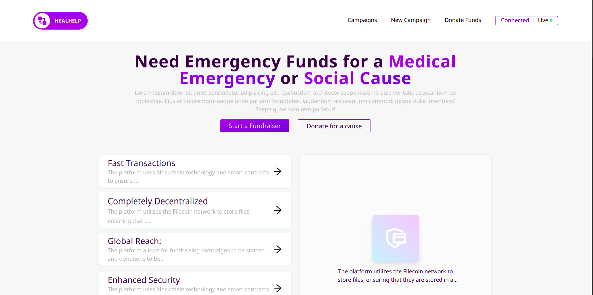
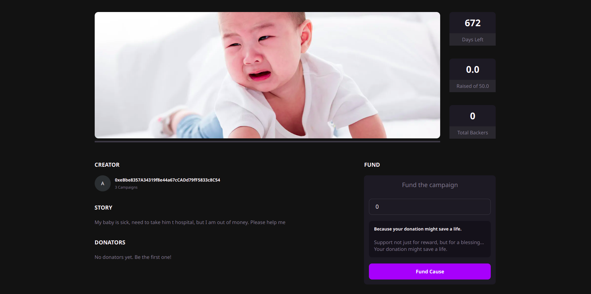
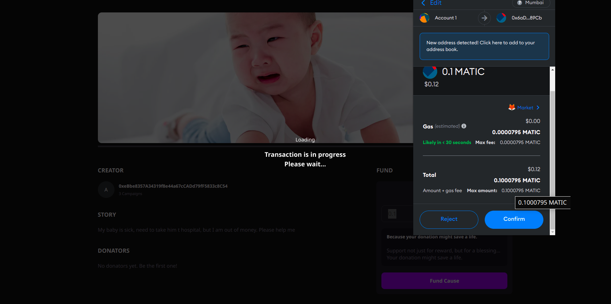

# Heal Help

Empowering Communities for Secure & Transparent Crowdfunding of Medical Emergencies & Social Causes

## Introduction

In this section, provide a summary of your project and its purpose. Explain the problem that it aims to solve and the value that it brings to the users.

## Configuration

1. First, make sure you have Node.js and npm (Node Package Manager) installed on your computer, You can check this by running the following commands in your terminal:

```
    node -v
    npm -v
```

> Read docs here [Node.js Documentation](https://nodejs.org/en/docs/)

2. Once you have npm installed you can run the following both to install and upgrade Yarn

```
    npm install --global yarn
    yarn --version
```

> Read docs here [Yarn Installation guide](https://classic.yarnpkg.com/lang/en/docs/install)

1. Clone the HealHelp project from GitHub

```
    git clone https://github.com/KarthikS373/heal-help.git
```

2. Once the project is cloned, navigate into the project directory and run the following command to install all the necessary dependencies:

```
    yarn install
```

3. Finally, to start the development server, run the following command in your terminal:

```
    yarn dev
```

> This will start the development server and you should be able to see your project running at [`http://localhost:3000`](http://localhost:3000) in your browser.

## Tech used and Code Explanations

The platform is built using the following technologies:

- Next.js: A React-based framework for building server-side rendered and statically generated web applications.
- ThirdWeb: A framework for building decentralized applications on the Ethereum blockchain.
- Tailwind CSS: A utility-first CSS framework for building responsive and fast-loading user interfaces.
- TypeScript: A statically typed superset of JavaScript that adds optional types to the language.
- Ethers.js: A complete Ethereum library for JavaScript that provides a seamless integration with the Ethereum blockchain.

### Why this tech stack?

We chose Next.js for its ability to handle both server-side rendering and static generation, making it easy to build fast-loading and SEO-friendly web applications. ThirdWeb provides a seamless integration with the Ethereum blockchain, making it easy to build decentralized applications that are secure and transparent.

Tailwind CSS provides a comprehensive set of utility classes that make it easy to build fast-loading and responsive user interfaces, while TypeScript provides the benefits of statically typed programming to JavaScript, making it easier to catch errors and improve the overall quality of the code.

Ethers.js provides a complete library for interacting with the Ethereum blockchain, making it easy to interact with smart contracts, send transactions, and access information about the blockchain.

## Media

<table>
  <tr>
    <td> </td>
    <td></td>
   </tr> 
   <tr>
      <td></td>
      <td>
  </td>
  </tr>
   <tr>
      <td></td>
  </td>
  </tr>
</table>
